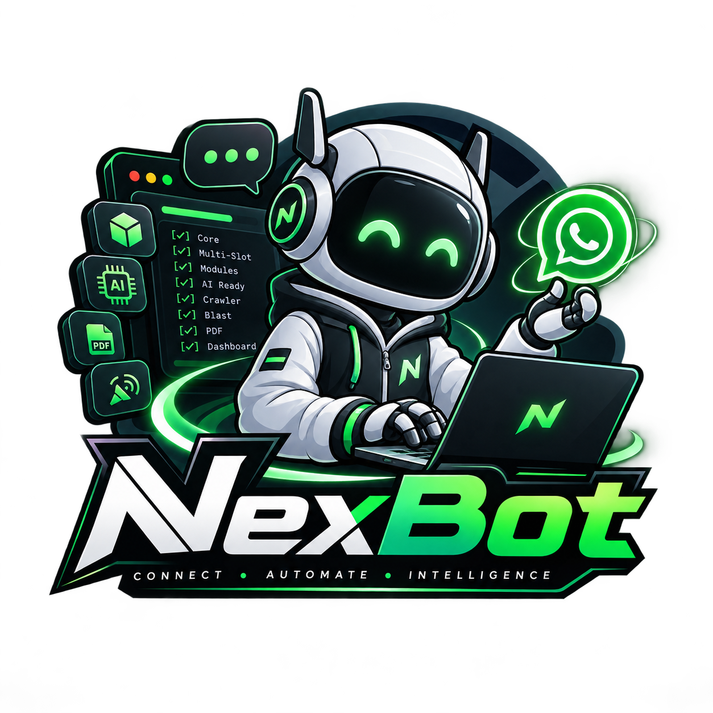

# NexBot

<p align="center">
  
</p>

<p align="center">
  <b>Platform kontrol bot WhatsApp multi-device berbasis Baileys</b><br/>
  Satu core untuk banyak bot. Satu dashboard untuk mengontrol semuanya.
</p>

<p align="center">
  <a href="LICENSE"></a>
  <a href="#"></a>
  <a href="#"></a>
  <a href="#"></a>
  <a href="CONTRIBUTING.md"></a>
</p>

<p align="center">
  Bahasa Indonesia: <a href="README.md"><b>id</b></a>
</p>

NexBot menyatukan 4 aplikasi bot WhatsApp yang tadinya terpisah menjadi **satu
repo dan satu mekanisme**. Semua kode koneksi, sesi, QR, dan reconnect dipakai
bersama lewat satu inti, jadi menambah bot baru tidak perlu menulis ulang
infrastruktur.

| Modul | Fungsi | Bridge (legacy) |
|-------|--------|-----------------|
| **AI-CS** (`src/modules/cs`) | Auto-reply menu webinar + broadcast grup, multi-slot `admin1/2/3` | `5591` |
| **AI-ADMIN** (`src/modules/admin`) | Crawler website, ekstraksi PDF, AI (Ollama), laporan harian, bisa ganti nomor dari dashboard | `5592` |
| **BLASTER** (`src/modules/blast`) | WA blast massal, 3 slot `s1/s2/s3` dengan anti-spam otomatis | `5588` |
| **DASHBOARD** (`dashboard/`) | Panel monitor & kontrol semua bot: log, PM2, QR, data, editor file | `5577` |

---

## Disclaimer

Penggunaan repo ini sepenuhnya **tanggung jawab individu masing-masing**. Anda
wajib memastikan setiap penggunaan **sesuai dengan hukum dan peraturan yang
berlaku** di wilayah Anda. Kami **tidak memfasilitasi, menangani, maupun
bertanggung jawab** atas pelanggaran hukum yang terjadi akibat penggunaan repo
ini. Penyalahgunaan untuk aktivitas ilegal, termasuk spam massal tanpa izin,
penipuan, *phishing*, atau pelanggaran Syarat Layanan WhatsApp, sepenuhnya
menjadi tanggung jawab Anda. Repo ini disediakan apa adanya (**as-is**), tanpa
jaminan apa pun. Gunakan secara bertanggung jawab; hormati ketentuan WhatsApp.

---

## Fitur Utama

- **Satu core Baileys** (`src/core/`) : `session.js`, `manager.js`, `bridge.js`,
  `paths.js`. Kode koneksi/sesi/QR/reconnect dipakai bersama, bukan ditulis ulang per bot.
- **Konfigurasi terpusat** (`src/config.js`) : semua port, path data, grup, dan
  timing cukup diatur di satu file.
- **Multi-slot** : AI-CS multi-admin (`admin1/2/3`), AI-ADMIN dan BLASTER juga
  bisa ganti nomor dari dashboard.
- **Unified bridge** (`src/core/bridge.js`) : satu port (default `5610`) dengan
  prefix `/cs`, `/admin`, `/blast`. Semua modul bisa jalan dalam satu proses.
- **Dashboard lengkap** : monitor PM2, log realtime, insiden, data bot, login,
  tunnel Cloudflare, editor file, dengan lock/session system.

---

## Struktur Direktori

```
NexBot/
├── package.json
├── ecosystem.config.js      # PM2 multi-proses
├── README.md
├── .gitignore
├── src/
│   ├── index.js             # entry utama (unified bridge)
│   ├── config.js            # KONFIGURASI TERPUSAT
│   ├── core/                # inti bersama Baileys
│   │   ├── session.js       # koneksi WASocket + QR + reconnect
│   │   ├── manager.js       # manajer multi-slot
│   │   ├── bridge.js        # unified HTTP bridge
│   │   └── paths.js         # helper path session/QR
│   └── modules/
│       ├── cs/              # AI-CS
│       ├── admin/           # AI-ADMIN
│       └── blast/           # BLASTER
├── dashboard/               # React + Vite + Express dashboard
└── data/                    # runtime (session, QR, DB, uploads) : di-ignore git
```

---

## Instalasi

### Prasyarat

- **Node.js 18+** (disarankan 20/22; diuji di v24)
- **Ollama** (hanya untuk AI-ADMIN) di `http://127.0.0.1:11434` dengan model `qwen2.5:1.5b`
- **PM2** global : `npm i -g pm2`
- Internet untuk koneksi WhatsApp & crawler website

### Langkah Cepat

```bash
# 1. Clone
git clone https://github.com/IsyaPrasetia/Nexbot.git NexBot
cd NexBot

# 2. Install dependensi backend
npm install

# 3. Build & install dashboard
cd dashboard
npm install
npm run build
cd ..

# 4. Jalankan multi-proses (recommended)
pm2 start ecosystem.config.js
```

> **Catatan kredensial Google Sheets** : taruh file service-account di
> `data/admin/credentials.json` (tidak di-commit, lihat `.gitignore`).

---

## Cara Pakai

1. **Scan QR setiap modul** : QR dicetak di terminal dan disimpan di `data/qr/`:
   - AI-CS   : `cs_qr_admin1.png` (utama/full), `admin2` (bulk), `admin3` (reply-only)
   - AI-ADMIN : `admin_qr_admin1.png` (slot aktif; ganti via dashboard `/setslot`)
   - BLASTER  : QR muncul di log (`s1/s2/s3`)

   Scan dengan nomor WhatsApp yang ingin dipasang. **Gunakan nomor uji coba**,
   bukan nomor bot produksi, agar tidak tabrakan dengan WhatsApp yang berjalan.

2. **Buka dashboard** : `http://localhost:5577` : login pakai akun di
   `dashboard/users.json`. Buat akun baru & ganti password sebelum dipakai serius.

3. **Ollama aktif** sebelum menghidupkan AI-ADMIN (untuk fitur AI/PDF).

### Menjalankan di Mesin Local

NexBot **tidak menyentuh bot produksi** : semua sesi & data di folder `data/`
(terpisah, kosong saat pertama clone), jadi bot produksi aman.

> ⚠️ **Port**: NexBot memakai port yang sama dengan produksi
> (5591/5592/5588/5577/5610). Kalau jalan **di mesin yang sama** dengan server
> produksi, ganti port dulu (lihat bagian "Ganti Port").

---

## Deploy dengan PM2

Setiap modul jalan sendiri, satu crash tidak menumbangkan yang lain.

```bash
pm2 start ecosystem.config.js
pm2 save                 # auto-start saat reboot
pm2 restart AI-CS        # restart satu modul saja
pm2 logs AI-CS           # lihat log satu modul
```

| Nama | Script | Port |
|------|--------|------|
| `NexBot-CORE` | `src/index.js` | 5610 |
| `AI-CS` | `src/modules/cs/index.js` | 5591 |
| `AI-ADMIN` | `src/modules/admin/index.js` | 5592 |
| `BLASTER` | `src/modules/blast/index.js` | 5588 |
| `DASHBOARD` | `dashboard/server/index.js` | 5577 |

---

## Ganti Port

Semua port diatur sekali di `src/config.js`:

- `bridge.port` (5610)
- `cs.port` (5591)
- `admin.port` (5592)
- `blast.port` (5588)
- DASHBOARD di `ecosystem.config.js` (`env.PORT`, default 5577)

Jika dashboard mem-proxy ke port, sesuaikan juga di
`dashboard/server/index.js` (proxy `/api/csbridge`, `/api/adminbridge`, `/api/blast`).

---

## Mengganti Nomor AI-ADMIN (Multi-Slot)

```bash
# lihat slot aktif
curl http://127.0.0.1:5592/slot
# ganti slot (QR baru akan muncul untuk nomor tsb)
curl -X POST http://127.0.0.1:5592/setslot -H "Content-Type: application/json" -d '{"slot":"admin2"}'
```

---

## Troubleshooting

- **Ollama mati saat proses PDF** → hidupkan `ollama serve`, restart `AI-ADMIN`.
- **QR tidak muncul di dashboard** → QR dianggap "fresh" ≤120 detik; pastikan slot masih menunggu scan.
- **Blast tidak jalan (consecutive fail ≥10)** → job otomatis di-pause (anti-ban); cek `data/blast/blast-log.jsonl`.
- **Lupa password dashboard** → hapus/edit `dashboard/users.json` (password di-hash scrypt).

---

## Kompatibilitas

- Semua bot asli (`cs.js`, `admin.js`, `blast.js`) **sudah berbasis Baileys** : tanpa migrasi dari `whatsapp-web.js`.
- Modul NexBot menjaga **semua logika bisnis asli** (auto-reply, broadcast,
  crawler, PDF pipeline, daily report, blast engine) : hanya jalur koneksi/sesi/path yang dipindah ke core & config.
- File asli disimpan sebagai referensi: `src/modules/<m>/<m>.original.js`.
- Dashboard **tetap kompatibel** dengan port legacy (5591/5592/5588) sehingga frontend tidak perlu diubah.

---

## Kontribusi

Panduan berkontribusi dan kode etik kami:

- [CONTRIBUTING.md](CONTRIBUTING.md) : cara PR, gaya commit, checklist
- [CODE_OF_CONDUCT.md](CODE_OF_CONDUCT.md) : kode etik komunitas
- [SECURITY.md](SECURITY.md) : cara melaporkan kerentanan
- [Licence](LICENSE) : MIT © Prasetia